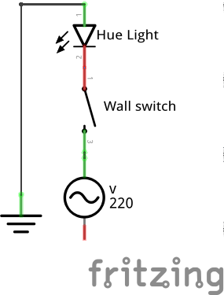

# Philips hue switch
Micropython code that toggles a philips hue lamp using wemos d1 mini or esp8266-01s

This project is to be used with a hardware switch making that existing wall
switch not cutting the power off but using the api to toggle the lamp's
state.

Some electrical assembly required :)

# WARNING
Only mess with high current if you really really know what you are doing. If
not certified to do so please refrain from it. It can definitely kill you,
which is not a desired outcome for any hobby project.

# Problem statement
Philips hue lamps are amazing, providing a wonderful solution for home
lighting. The only problem is that the way they are operated leaves some
things to be desired.

When the traditional switch is off the lamps of course
can not be operated through the app, but only using the app is not realistic
for all lights and all conditions. Also people coming over do not have access
to the app and many people in a house create confusion.

The current solution is to purchase a separate wireless switch from
Philips to use with the lamps but that can get really expensive really quick
if you want one for each lamp and of course that does not solve the
problem of the traditional switches that either will disrupt the usage of
the lights or have to be taken out. Not fun.

# Solution
All lights can be operated through the api provided by the hue bridge.
Instead of using the switch to cut the power to the lamp leaving it useless,
we rewire the lamp to be constantly powered and the switch to an esp8266-01s
board to toggle the lamp through the api. That way our switch works as before
for all, toggling the state of the lamp and the lamp continues to be
accessible through the app all the time. Sweet right?

so we want to go from this initial state:

to this state (schematic depicting an esp01s):

# Requirements
[Enable hue api access to your bridge](https://www.developers.meethue.com/documentation/getting-started)

If project is based on a wemos D1 mini

* [wemos d1 mini](https://www.aliexpress.com/item/D1-mini-Mini-NodeMcu-4M-bytes-Lua-WIFI-Internet-of-Things-development-board-based-ESP8266-by/32644199530.html)

* [220v to 5v power converted](https://www.aliexpress.com/item/5V-700mA-3-5W-AC-DC-Precision-Buck-Converter-AC-220v-to-5v-DC-step-down/32649591757.html)

If project is based on an esp8266 01s (Current documentation mentions this case.)

* [esp8266-01s](https://www.aliexpress.com/item/New-Version-ESP8266-ESP-01-ESP01-Serial-Wireless-WIFI-Module-Transceiver-Receiver-Board-for-Internet-of/32799606069.html)

* [220v to 3.3v power converted](https://www.aliexpress.com/item/AC-220-V-to-3-3-V-DC-power-supply-module-transformer-module-is-completely-isolated/32768604824.html)

# Physical Connection

You can see pictures of the connectivity under the [images](images) directory.

# Schematics

Images in png format and a fritzing project for each case can be found under [schematics](schematics)

# Configuration

 Rename configuration_sample.json to configuration.json and edit accordingly.
  Everything else should just work out of the box.

# Flashing micropython

To load this project the microcontroler needs to be running micropython and you
need [ampy](https://github.com/adafruit/ampy)

Required tools:

#esp8266-01s specific
To flash the esp8266-01s a component to connect it to usb is required.
Remember that it is 3.3v power and *will* fry with 5v.

* [esp8266-01s programmer](https://www.aliexpress.com/item/ESP01-Programmer-Adapter-UART-GPIO0-ESP-01-Adaptaterr-ESP8266-USB-to-ESP8266-Serial-Wireless-Wifi/32704996344.html)

In order for the board to be flashed it has to be booted up with d0 pulled
low. That means that when the board is booted d0 should be connected to
ground.

The easiest way to do that is to stick a thin cable in the
appropriate holes as can be seen [here](images/IMG_20170519_095341.jpg). This
 of course can get pretty old pretty quick if you have a few boards to flash.

  The right solution is to add a jumper between ground and d0 as can be seen
  [here](images/IMG_20170518_141529.jpg) and [here](images/IMG_20170518_165919.jpg)
and choose the appropriate mode of booting by using the jumper cap or not.

Of course in order for the project to work properly when used the esp8266-01s
 has to be booted with d0 high, so it does not enter in flash mode.

 In order to fix this a 10K pull up resistor has to be connected between d0
 and VCC (3.3v) so the pin is kept high and boots into running mode even if
 rebooted.

 In order for the switch to not interfere with the booting process we are 
 using RX (gpio03) as input pulled high through software.

# common for both wemos d1 mini and esp8266-01s
   [esptool](https://github.com/espressif/esptool) (Follow installation instructions)

  With the board connected to a usb port of your linux box assuming that the
  port is ttyUSB0 (check with dmesg after connecting to see what is assigned)

  After the first command you might have to reboot the board, or just
  disconnect and connect again.

    esptool.py --port /dev/ttyUSB0 erase_flash
    esptool.py --port /dev/ttyUSB0 --baud 460800 write_flash --flash_size=detect 0 MICROPYTHON_FIRMWARE_FOR_ESP8266.bin

  I have had some wemos d1 mini boards having trouble flashing with the above
  with garbage on the serial and the led staying on. On those boards this
  command works.

    esptool.py --port /dev/ttyUSB0 write_flash -fm dio -fs 32m 0 MICROPYTHON_FIRMWARE_FOR_ESP8266.bin

# Loading the project

Required tools:

   [ampy](https://github.com/adafruit/ampy) (Follow installation instructions)

    export AMPY_PORT=/dev/ttyUSB0
    ampy put library
    ampy put configuration.json
    ampy put main.py
    ampy put boot.py
